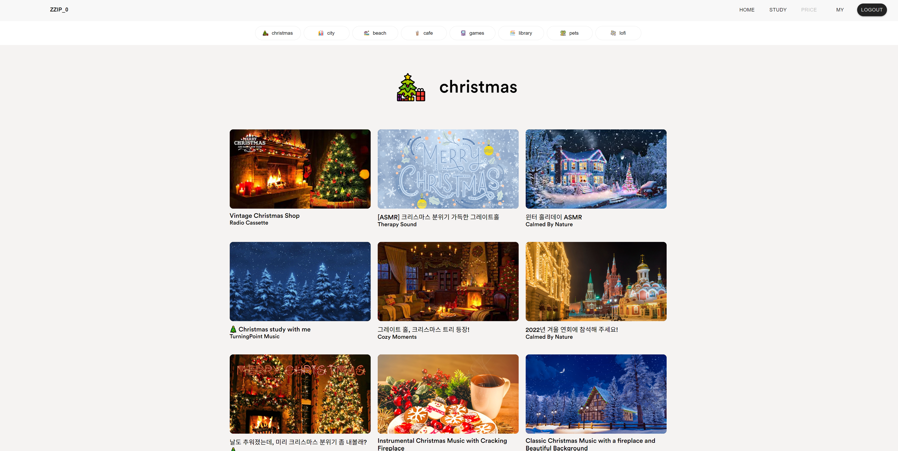
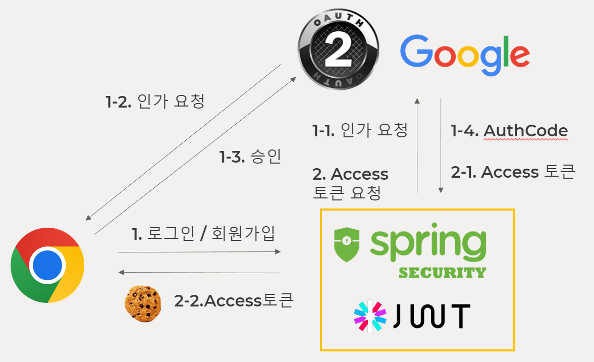
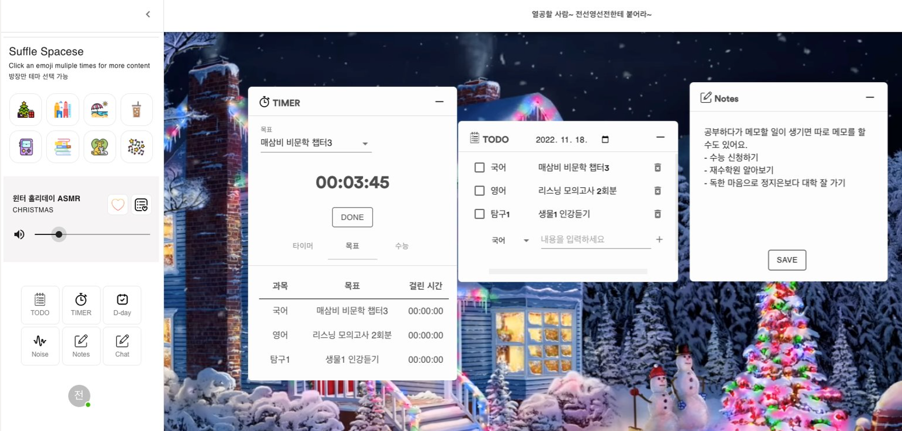
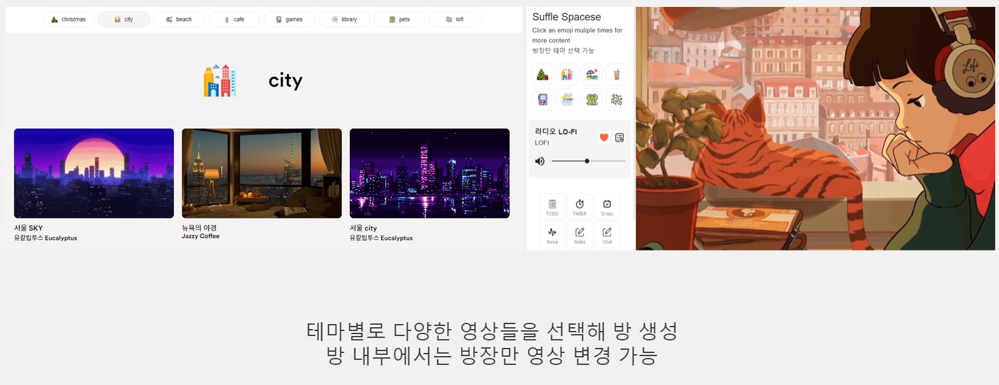
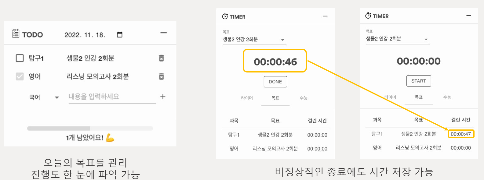
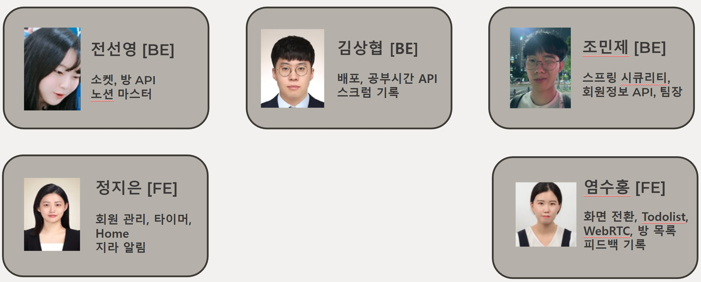

# zzip_0

## 프로젝트 소개

zzip_0은 집에서 편하게 공부하기 위한 나만의 공부 집사 서비스입니다.

 

[홈페이지 링크](https://zzip0.com/, "홈페이지 링크")

 

## 목차

1. [아키텍처](#아키텍처)
2. [서비스 소개](#서비스-소개)
    - [소셜 로그인](#소셜-로그인)
    - [공부방](#공부방)
    - [테마별 영상](#테마별-영상)
    - [기록 요소](#기록-요소)
    - [커뮤니티](#커뮤니티)
3. [산출물 목록](#산출물-목록)
4. [팀원](#팀원)

 

## 아키텍처

 

## 서비스 소개

### 소셜 로그인

### 공부방

### 테마별 영상

### 기록 요소

### 커뮤니티

 

## 산출물 목록

|내용|링크|
|---|---|
|ERD|내용|
|API 명세서|내용|
|UCC|내용|

## 팀원

| 팀원 | 조민제 | 김상협 | 염수홍 | 전선영 | 정지은 |
| :-: | :-: | :-: | :-: | :-: | :-: |
| 분야 | 팀장,BE | BE | FE | BE | FE |
|   역할    |   ![js]    |   ![ts]    | ![react] | ![node] | ![node] |

 
