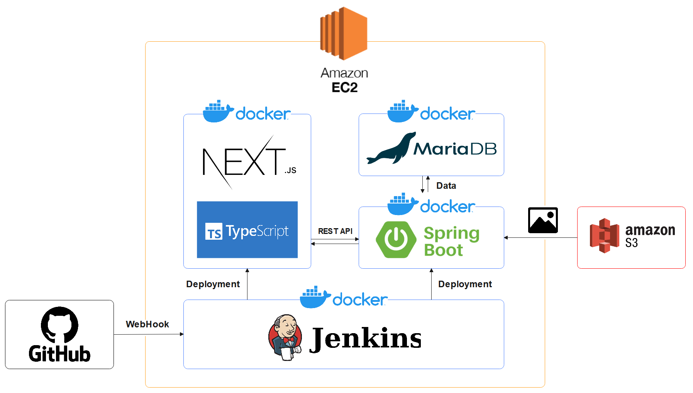
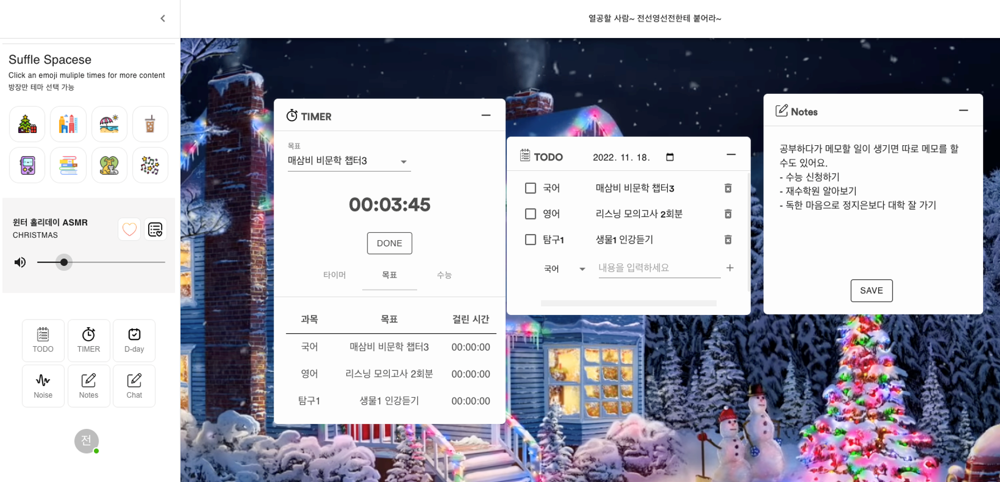
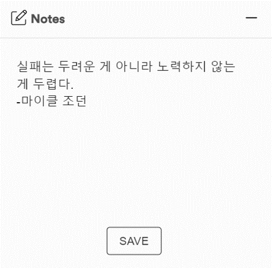
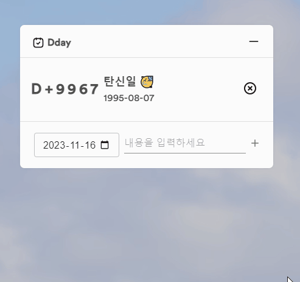
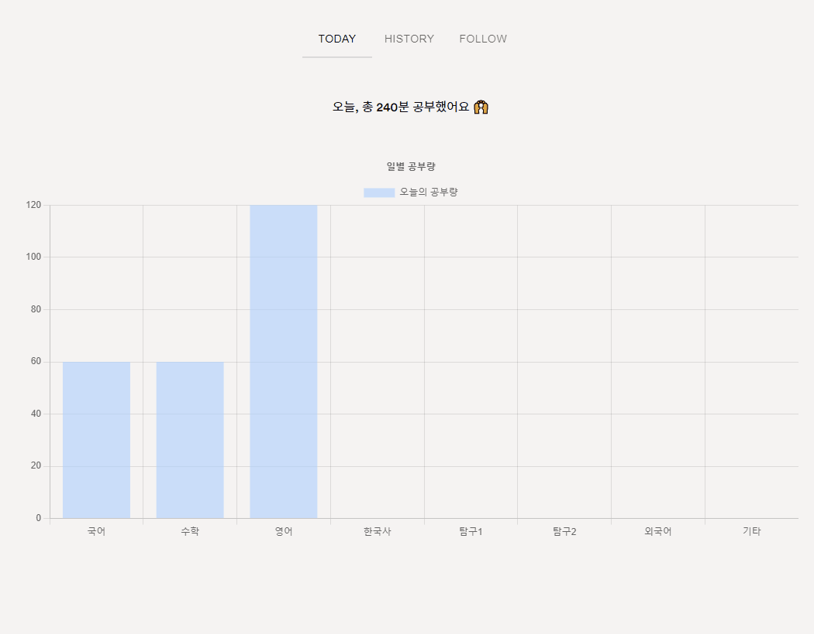
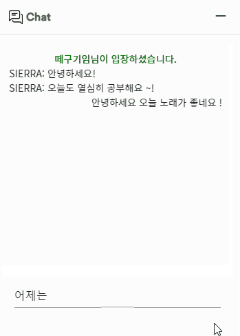
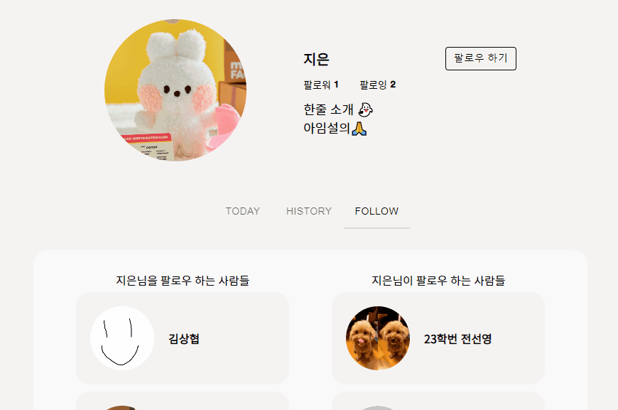

# 🏠zzip_0 (집공)🏠

### 집에서 공부하고 집중해서 공부하자 !

<aside>
📝 여러 테마의 영상으로 공부 분위기를 조성하고, 친구들과 함께 각자 집에서 음악, 백색소음을 들으며 공부할 수 있습니다.

</aside>

---

### 기술 스택

- **FrontEnd**
    
    <div style="display: flex; align-items: flex-start;"></div>
    
- **BackEnd**
    
    <div style="display: flex; align-items: flex-start;"></div>
    
- **CI/CD**
    
    <div style="display: flex; align-items: flex-start;"></div>
    

---

### 아키텍쳐



---

### 서비스 소개

##### 1. 공부방



```
공부를 할 수 있도록 각종 서비스가 제공되는 장소
소켓 통신을 이용하여 구축
```

##### 2. 테마별 영상


```
외부 장소에서 공부하는 듯한 영상을 재생해 분위기를 조성할 수 있음
기호에 따라 전체 화면 설정을 하거나 백색 소음을 조절이 가능
```

##### 3. 기록 요소



```
메모 기능
```



```
일정 관리를 위한 D-Day 관리
```


```
어떤 과목을 어떤 날짜에 어떻게 공부할지 관리하기 위한 To-do List
해당 날짜의 공부 진행 현황을 파악할 수 있음
```

##### 4. 타이머


```
오늘 할 일을 계획하지 않았거나 가볍게 공부하고 싶을 때 사용하기 위한
카운트 업 방식의 타이머
```


```
To-do List에 기록된 공부를 얼마나 했는지 측정하기 위한
카운트 업 방식의 할일 타이머
```


```
수능 수험환경에서 시험을 보는 느낌을 주기 위한
카운트 다운 방식의 수능 타이머
```

##### 5. 타임 뷰



```
과목별 공부량을 일별, 월별, 연도별로 차트를 통해 제공
```

##### 6. 커뮤니티



```
공부방 구성원 간 상호작용이 가능한 채팅
```



```
마음에 드는 상대를 추가할 수 있는 팔로우
팔로우 한 후에는 상대방의 공부량을 구경하는 것도 가능
```

##### 7. 소셜 로그인


```
구글 소셜 로그인 지원
```

---

### 산출물
|산출물 List|
|---|
| [ERD 다이어그램](./images/erd.png) |
| [API 명세서](https://www.notion.so/a57d17b4d2d9440abc3dc749c44cb123?v=e12053c9c3454bb28a9211ff8c967b19) |
| [UCC](./images/talkv_high.mp4) |

---

### 팀원

| Backend | Backend | Backend | Frontend | Frontend |
| --- | --- | --- | --- | --- |
|  |  | |  | |
| [조민제](https://github.com/minje0204)| [김상협](https://github.com/rotter9027) | [전선영](https://github.com/sally2596) | [염수홍](https://github.com/2riing) | [정지은](https://github.com/zzz0105) |
